# Jack Walker Portfolio Project 

[Website Link](https://jackdwalker.github.io/Portfolio/src/)   
[Github Repo Link](https://github.com/jackdwalker/Portfolio) 

## My Website 

### Purpose
The purpose of developing this website was three-fold. Primarily it was made as an assessment piece, showcasing what I had learnt about HTML and CSS, and how I could apply those lessons. Secondly it was created to display my skills, work history, and a little bit about myself to potential employers and anyone else what was interested. Thirdly it was a fun exercise in engaging creative process and infusing a bit of myself in the code I was creating.

### Functionality/Features
The website features a responsive mobile-up design, scaling nicely from widths of 320px right through to 2880px. It has metadata in its header to allow the various different web crawlers to access certain pieces of information about my site, to help it show up in search engines. It features easily identifiable (at least I think - but this is a matter of opinion) anchors allowing intuitive site navigation, with smooth scrolling. I wanted to make the site fun to play with and move around, so I implemented a touch of JavaScript (JS) to allow my content panels to slide in and out. When minimised the content panels take little screen real-estate, allowing users to have a better view of the art I used on my website. I also used JS to create a back to top button that will only display itself after the user has scrolled past the page they load on to. Finally I implemented a contact form that will at some stage utilise a PHP or SQL database as a way to store messages. This felt like a safer way to allow users to contact me. I wasn't comfortable openly displaying my email on a public website for security reasons. I used SCSS to style my website in a way that represented me, and in a way that I personally think looks really appealing and fun to navigate. Plus there's the little glowy boys on my front page that will glow when you mouse over them :D

### Sitemap
I used a single page design with multiple internal anchors to navigate to my page's contents, and external links to other places users can find me on the Internet.

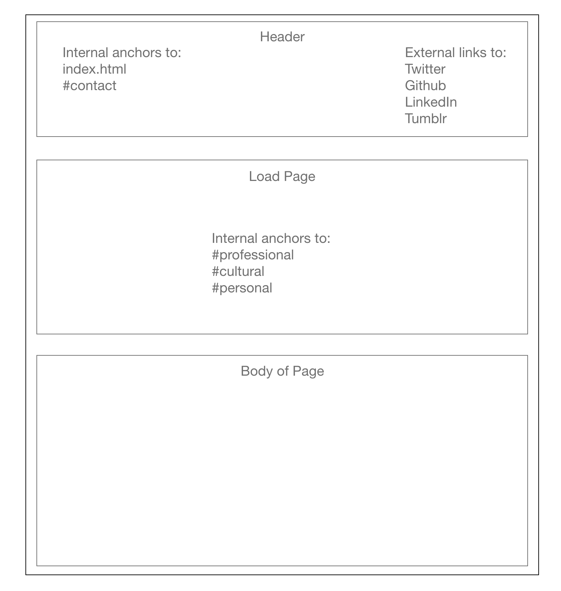

### Screenshots
Load page w/ header - desktop
Load page w/ header - mobile
Example of content w/ panel closed - desktop
Example of content w/ panel open - desktop
Example of content - mobile

Tablet format is just the same as desktop but with some small formatting changes to font size for readability.

### Target Audience
This project was first and foremost designed to appeal to potential future employers, other software developers and colleagues, and give them an idea of who I was, and what skills I possess, presenting a bit of my personality in the process. I also wanted to build a page that could showcase what I had learnt so far at the Coder Academy bootcamp to my friends and family. Finally I wanted a website that would strike interest in people who had accidentally navigated to my page, and engage them for at least a little while before they returned to searching for the original page that they were looking for - who knows who might stumble upon your page.

### Tech Stack
The base for my website was built using HTML5 and I styled it using CSS compiled from SCSS. I called the Google Fonts API to use my font choice, 'Work Sans', and the Font Awesome CDN to utilise some groovy little icons throughout my website.

In the future I plan to implement a PHP database in the back-end so that I can take messages from my contact form. I will hopefully also convert my website to Ruby on Rails in the near future as this content is covered in my course!

## Design Documentation

### Moodboard
Up until around a year ago my best friend and I were reblogging posts on Tumblr for a music project which formed somewhat of a moodboard for all of the things that interest us. We shared a very similar taste, so I used that Tumblr page to inspire my website design colour palette, style, and art direction.

[Umbra Lookbook Tumblr](https://umbralookbook.tumblr.com/)

### The Design Process
After taking inspiration from my moodboard I set out to create a minimal white-on-black website, with heavy use of imagery to really help showcase my personality.

I didn't have a set idea of how I wanted my website to look - mostly due to a lack of planning or forethough as I discuss in the details of my planning process below - so I implemented different design elements as they came to me.

Two similar ideas went into the design of my nav bar. I wanted users to be able to access the home page (as that was where they would navigate to the different pieces of content), and the contact form at any time. To reinforce this idea, I created a back to top button, that would also allow users to get back to the home page, as soon as they had scrolled past it regardless of device size or browser used. I also wanted users to be able to access my different social media/Github redirects at their leisure if for whatever reason a piece of content inspired thme to do so. I originally intended for the mobile version to have collapsible internal anchors, that would move into a hamburger for mobile sized devices (as you will see in my mobile wireframe below), but I didn't end up having time to implement this, and it still functions fine in the current iteration. This is something I would like to change in the future though. 

My content sections were originally just images with semi-transparent panels (so users could see the art featured on my website if they weren't focusing on the content) sitting on top of them, holding the body of my content. This was fine, but I wanted something that looked more engaging. On the same day I was shown a past student's webpage (I think it was Kieran?) who utilised parallax styling on his images. I thought it looked super cool, so found a way to implement that for the different content sections of my website. The final step in the design of my content section was to push the content into collapsible sidebars that would open and close upon clicking. The main design paradigm I had in mind during all of these different stages was allowing the user to look at the content on my website that engaged them, in a way that didn't clutter the screen space. If that was the content body's text, they should be able to see that content, if they wanted to only see the art, then they should be able to push the content away. I tried to implement this paradigm in an intuitive way that was accessible to anyone.

I wanted users to be able to contact me, but didn't want to publically expose my email address on Internet, so I created a contact form. Leaving it publically available would leave me vulnerable to spamming attacks, and potentially allow to people brute force my logins to various websites having half of the required credentials (i.e. only needing to guess my password). The contact form solves this problem by allowing users to send me messages with their contact details, and storing these messages in a PHP database. People might be able to use this to DoS my website, or use cross site scripting attacks if I don't implement the PHP code properly, but I still feel like it is the most secure design decision I could make given my options.

### Wireframes
Mobile Wireframe:\
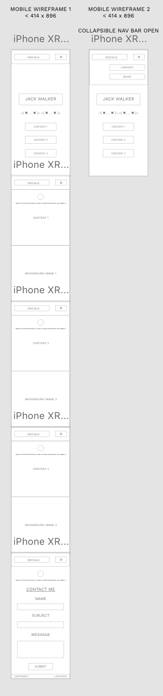

Tablet Wireframe:\
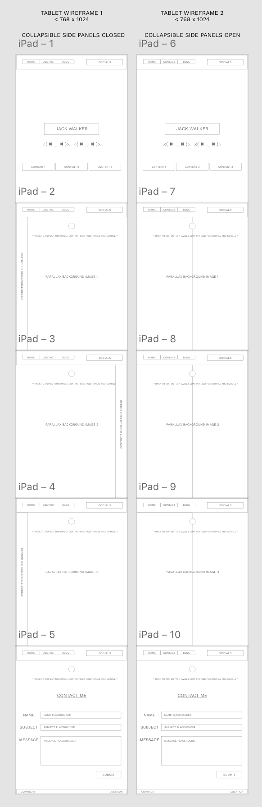

Desktop Wireframe:  
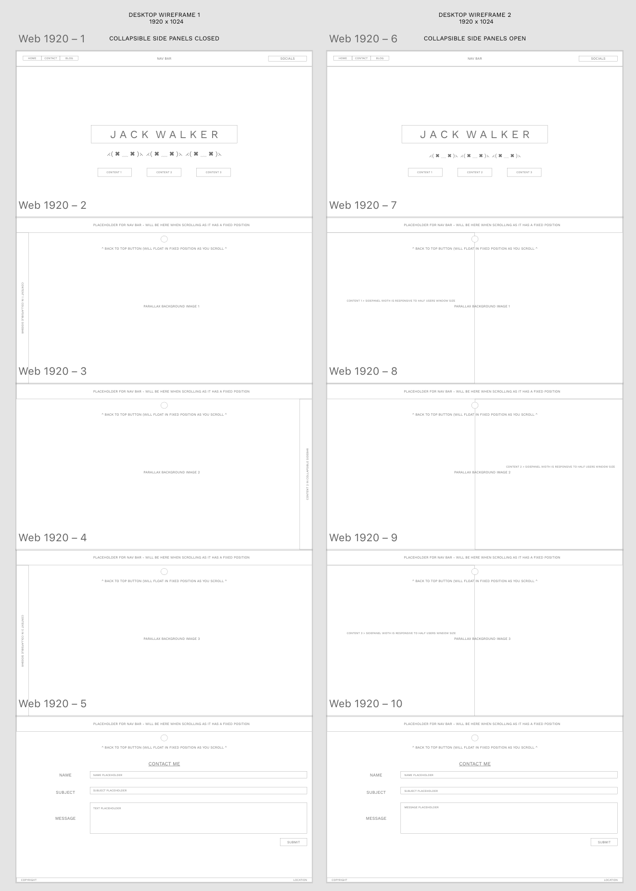

### Personal Logo
I did design a very simple logo, but only for favicon purposes:
<!-- 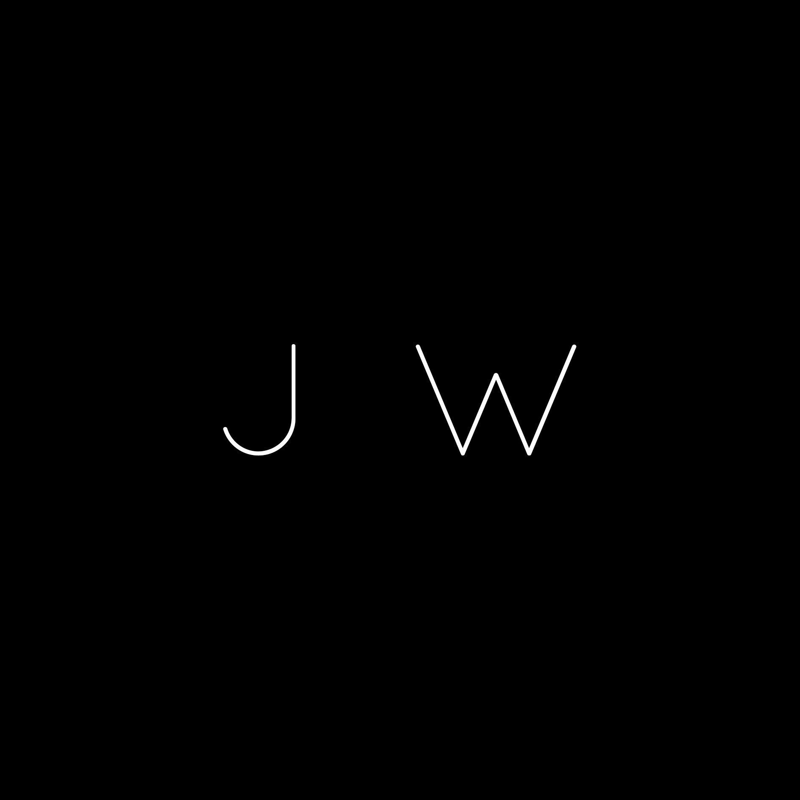 -->

### Usability Considerations
#### Accessibility
I strove to make my website as accessible as possible for people with visual impairments. I tried to keep colour-blindness in mind when I chose my theme colours, and after already leaning towards white-on-black it made it an easy decision for me to make. I tried to keep my remaining color palette at an acceptable degree of contrast for anyone to be able to visually engage with my content. I ensured to have appropriate alt-text for my pictures so that screen readers would be able to accurately describe the picture to the blind or visually impaired users of my website.

I also configure my favicon in such a way that any browser or device should be able to access it:
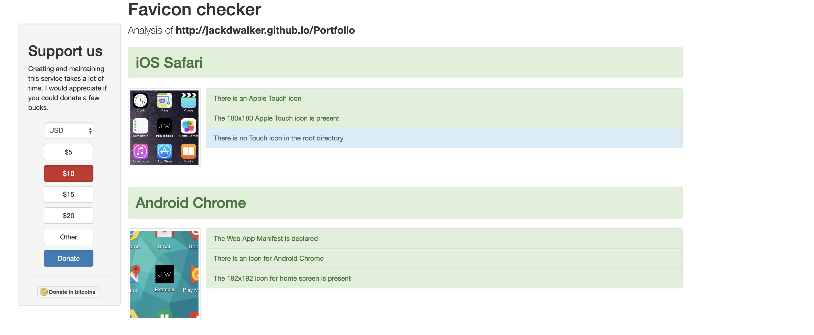
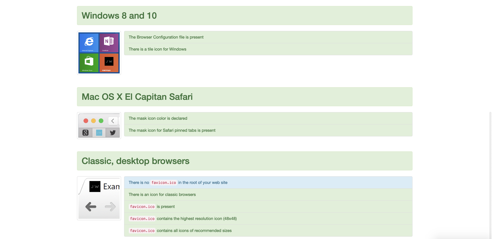

#### Performance
With a very image heavy website, loading speed can be an issue. I tried to compress my images to as small a size as possible without affecting the visual quality of the picture.

My page only uses one font, with three different weights, and very minimal JS so the performance of my website was largely uneffected by these design elements.

In the future I want to implement psuedo-element shadow transitions for the glowing emojis on my load page, as that would significantly reduce the performance overhead of the shadow transition effect they utilise.

#### Performance and Accessibility Audits
Mid-way through project:
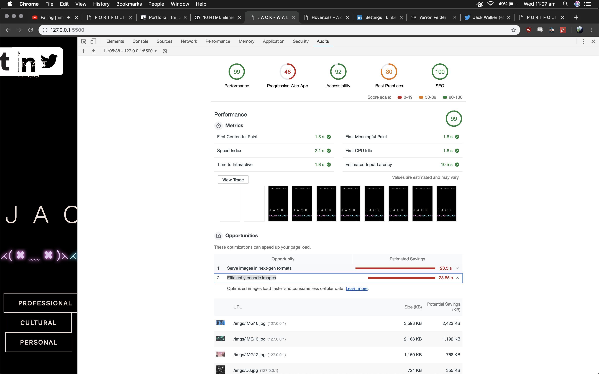

End of project:
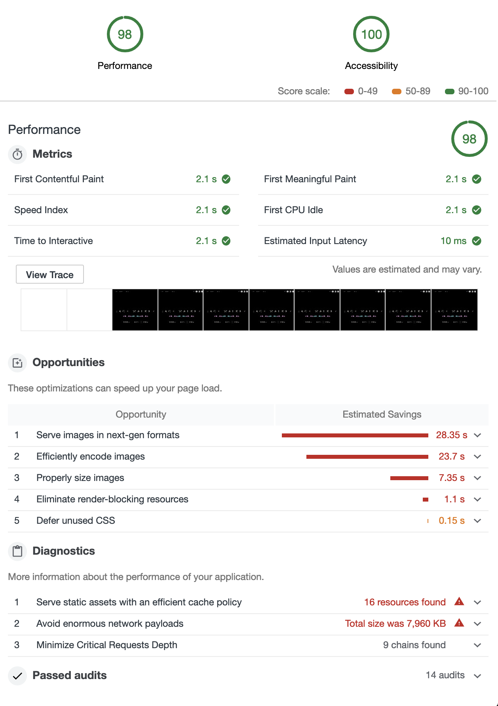

### Challenges
I encountered a really large number of time consuming problems throughout this process. A lot of these can be attributed to poor planning, and specificity issues, but some of the other major ones included: 
* Creating a responsive header with flexbox
* Creating a responsive contact form with flexbox
* Parallax issues outside of the desktop version and being unable to convert it to flexbox
* Maintaining the same HTML base, but requiring one set JS functions in my mobile version, and another on my desktop/tablet version
* I'm just going to mention specificity again because I wasted countless hours to specificity problems :(

## Details of Planning Process
Honestly my planning process was pretty awful, and it's shown in how messy my workflow has been for this project.

I came into the bootcamp with a small amount of background knowledge in HTML/CSS. So when we progressed to the HTML/CSS section of the course I was eager to get a head-start hoping to create a really cool website for myself, knowing that this was something I would be using to represent myself out in the real world. I drew some inspiration from my Tumblr page and off I went. I ended up with a pretty decent looking desktop webpage, that had absolutely zero responsiveness that didn't utilise SCSS whatsoever. 

So I went back to the drawing board and made wireframes detailing how I wanted to restructure my website to work on both mobile and tablet devices. I started from scratch refactoring my desktop CSS into SCSS, and re-writing my whole HTML base for a mobile device and working up from there. 

### Project Timeline
- Mar 11: Moodboarding
- Mar 12-15: Initial desktop site design
- Mar 18-19: Final touches on first version of desktop site
- Mar 20: Wireframing and beginning to visualise how to make my website responsive
- Mar 21: Began the process of building mobile-up and refactoring my CSS into SCSS
- Mar 22-23: Most of the progress for my second website iteration was completed
- Mar 24: Documentation (definitely should've done this in advance - my time management sucks) and final touches on website

Image documentation showing Trello progression, Inspector audits, Favicon implementation, etc were created at different stages of the development process. Only the text component of the documentation was done post-development.

### Project Management

I used Trello to dissect my website components into different tasks, and assign myself rough time-frames for completion. My time-frames were pretty out, but I feel I have a better handle on how to time-manage myself in the future now.

[Portfolio Trello Board](https://trello.com/b/AWMZPskp/portfolio)

#### Trello Progress

Start of March 20th:

End of March 20th:

March 21st:
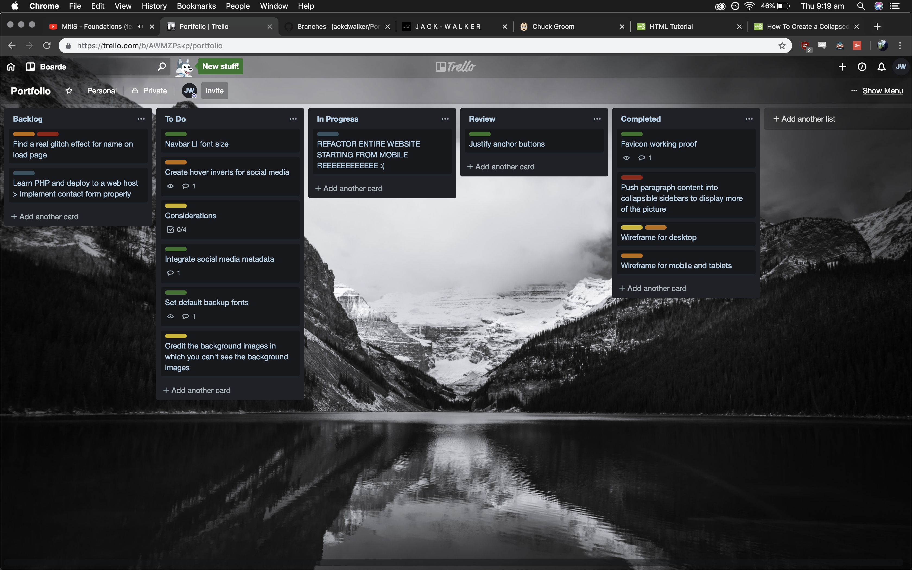

March 22nd:
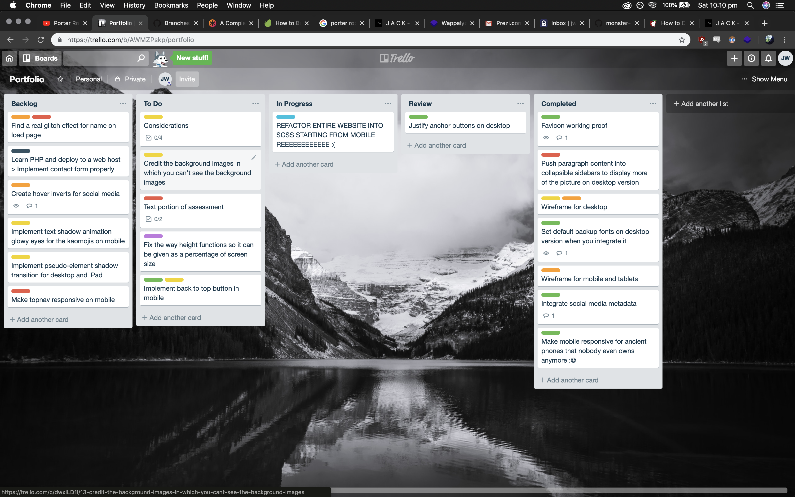

March 23rd:
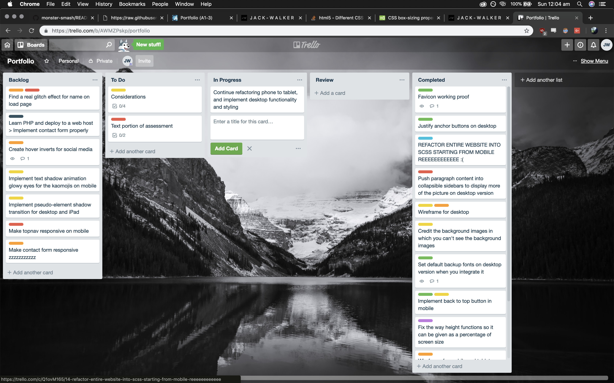

End of Project:
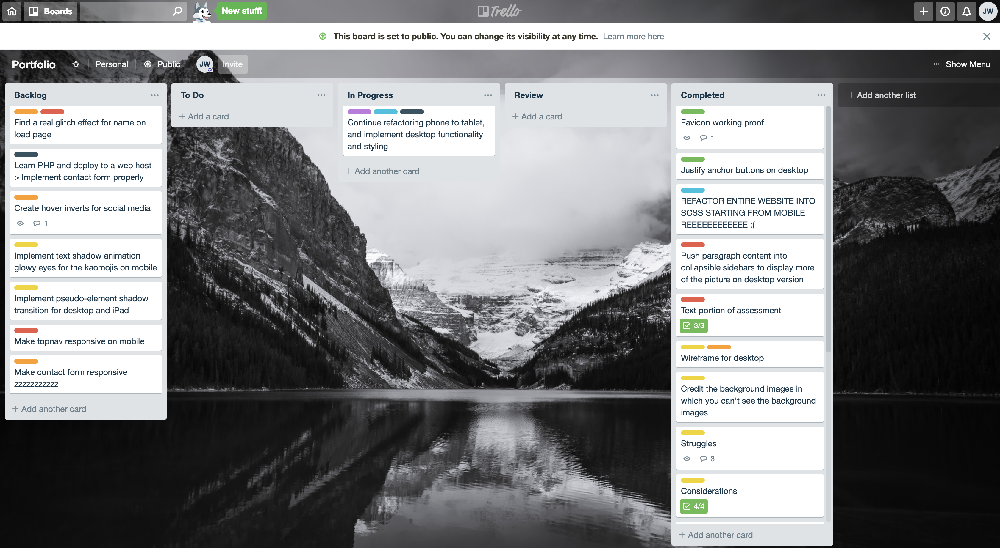

## Short Answer Q & A:

### 1. Describe key events that led to the development of the internet from the 1980s to today
ARPAnet (Advanced Research Projects Agency) goverment network - J.C.R. Licklider - network of computers that could talk to one another > 1971 Ray Thomlinson email @ to tell name and host name apart > Vinton Cerf TCP/IP > 80s scientists used > 90s world wide take off Tim Berners 1991 invented WWW. Erwise 1992 first GUI, Mosiac 1993 popularised
### 2. Define and describe the relationship between fundamental aspects of the internet such as: domains, web servers, DNS, and web browsers
Each device has IP, connect to ISP (middle man to internet backbone). Servers have domain names because IP addresses aren't exactly easy to memorise. Packets and the candy wrapper. Browsers are used to call on IPs and for server contents based on URL
### 3. Reflect on one aspect of the development of internet technologies and how it has contributed to the world today
